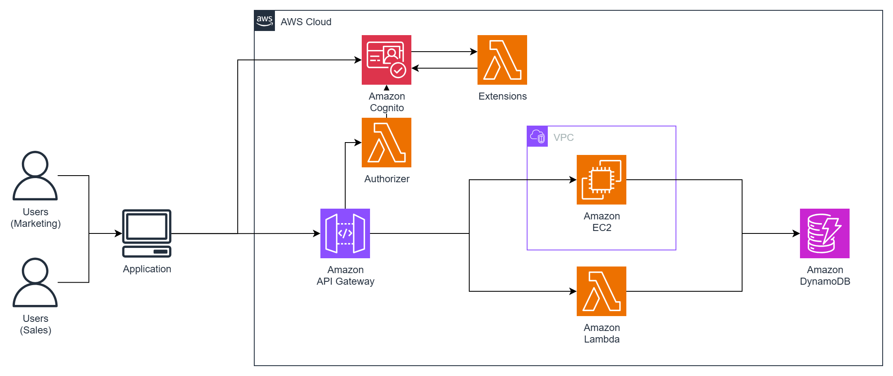

# Workshop - Authentication & Authorization with Amazon Cognito

Trong bài thực hành này, chúng ta sẽ tìm hiểu về Amazon Cognito và từ đó áp dụng vào trong một ứng dụng mẫu để hiểu hơn về dịch vụ này. Bài thực hành này sẽ giúp bạn hiểu hơn về Authentication (xác thực) và Authorization (Uỷ quyền).

- Tác giả: Nguyễn Anh Tuấn.
- Từ: FCJ DNTU.

Mong có thể giúp các bạn có thêm được nhiều kiển thức thông qua bài thực hành này.

---

## Prerequisites

Để có thể thực hành được bài này thì bạn nên:

- Đã có kiến thức cơ bản về điện toán đám mây, với bài này thì bạn cần biết về AWS.
- Có tài khoản AWS.
- Có kiến thức cơ bản về lập trình, git và github.
- Có kiển thức cơ bản sử dụng CLI.
- Và cũng nên biết qua về Backend Development.

---

## Introduction

Giới thiệu nhanh qua bài thực hành thì trong bài này, chúng ta sẽ thực hiện thao tác với AWS Console để tạo ra một số dịch vụ cần thiết, cùng với đó là chúng ta sẽ tiến hành xây dựng một ứng dụng nhỏ để làm ví dụ.

Và mục tiêu chính là chúng ta sẽ xây dựng một module mà nó cho phép mình có thể thực hiện xác thực và uỷ quyền người dùng.

Sau khi triển khai thành công xong thì chúng ta sẽ đưa module này lên serverless với Lambda và API Gateway.

> Dù đây là một bài workshop đơn giản, nhưng mình tin rằng nó sẽ giúp cho các bạn mới có thể hiểu được phần nào về Authentication và Authorization, từ đó có thể áp dụng vào trong dự án riêng của các bạn.

Nếu bạn sẵn sằng rồi thì bắt đầu thôi, truy cập: https://fcj-dntu.github.io/cognito-workshop/
